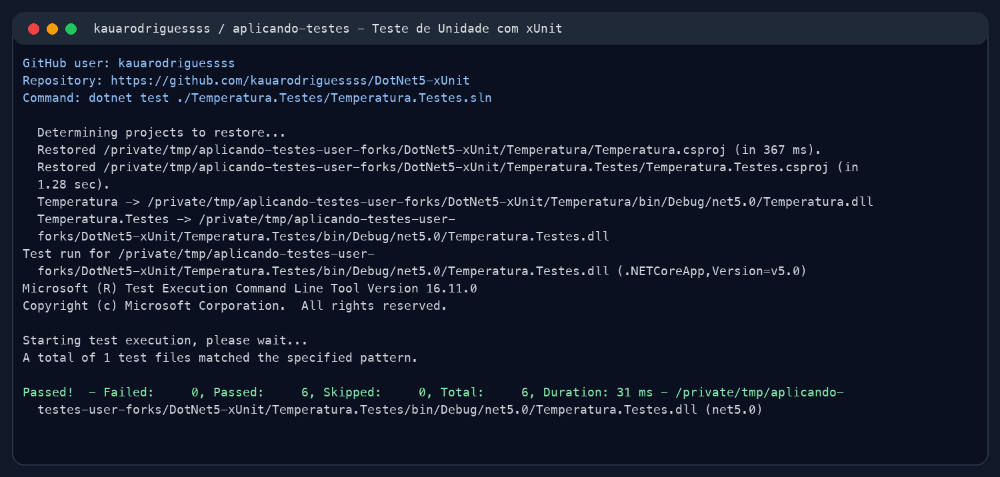
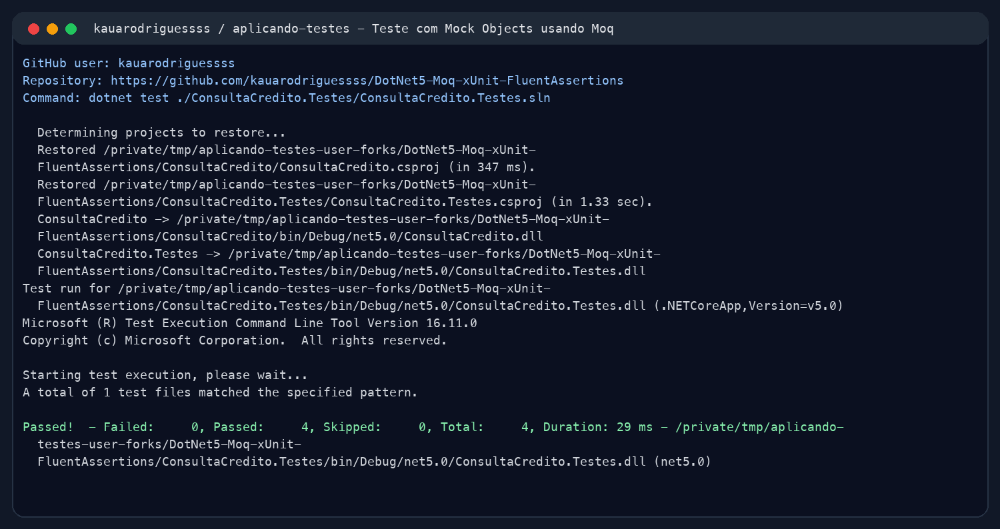

# Aplicando Testes

Neste repositório eu organizei a documentação do exercício sobre testes em .NET 5, usando como base o tutorial do Renato Groffe e os três repositórios de exemplo.

A ideia foi separar bem cada tipo de teste para ficar fácil de entender o que eu rodei, por que aquele teste existe e qual cenário ele cobre.

## Forks usados

- [DotNet5-xUnit](https://github.com/kauarodriguessss/DotNet5-xUnit)
- [DotNet5-Moq-xUnit-FluentAssertions](https://github.com/kauarodriguessss/DotNet5-Moq-xUnit-FluentAssertions)
- [ASPNETCore5-REST_API-xUnit-SpecFlow-Swagger-Docker_JurosCompostos](https://github.com/kauarodriguessss/ASPNETCore5-REST_API-xUnit-SpecFlow-Swagger-Docker_JurosCompostos)

## Barema

- A revisar na entrega final.

## Teste de Unidade com xUnit

Aqui eu olhei para o projeto de temperatura. O teste de unidade fica bem direto: ele chama o método `FahrenheitParaCelsius` e compara o resultado calculado com o valor esperado. Achei um bom exemplo porque não depende de banco, API ou serviço externo; é só a regra matemática sendo validada.

Fork: [kauarodriguessss/DotNet5-xUnit](https://github.com/kauarodriguessss/DotNet5-xUnit)

Cenários que peguei do próprio repositório:

- Quando a entrada é `32°F`, o resultado esperado é `0°C`.
- Quando a entrada é `212°F`, o resultado esperado é `100°C`.

Print da execução:

## Teste com Mock Objects usando Moq

Nesse segundo exemplo eu vi como o teste usa Mock Objects para simular o serviço de consulta de crédito. Em vez de chamar um serviço real, o Moq devolve respostas combinadas para cada CPF, e o Fluent Assertions deixa a validação mais legível.

Fork: [kauarodriguessss/DotNet5-Moq-xUnit-FluentAssertions](https://github.com/kauarodriguessss/DotNet5-Moq-xUnit-FluentAssertions)

Cenários que peguei do próprio repositório:

- Quando o CPF é `123A`, o mock retorna `null` e o sistema entende como `ParametroEnvioInvalido`.
- Quando o CPF é `82226651209`, o mock retorna uma pendência e o sistema classifica como `Inadimplente`.

Print da execução:

## Teste BDD com SpecFlow

Em andamento.
